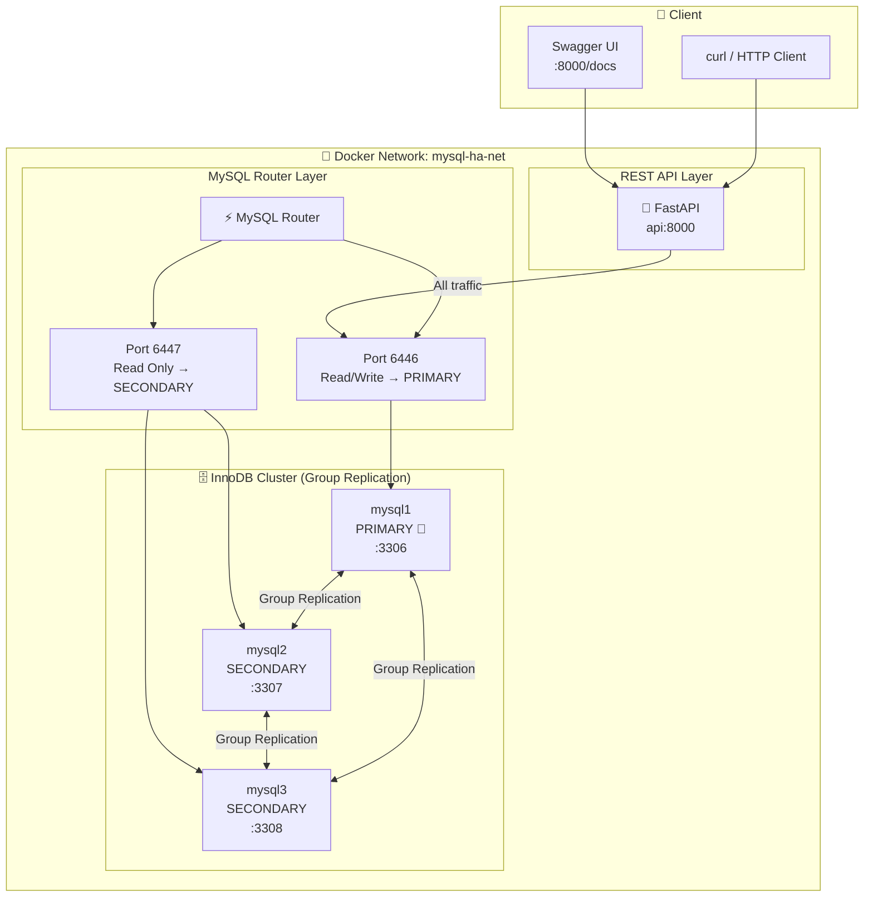

# mysql-ha-lab

> Lab pembelajaran **MySQL High Availability** menggunakan **MySQL InnoDB Cluster** dan **MySQL Router** berbasis Docker Compose.

[](https://www.mysql.com/)
[](https://docs.docker.com/compose/)
[](https://fastapi.tiangolo.com/)
[](https://www.python.org/)

---

## 📖 Project Overview

Repository ini adalah **Proof of Concept** implementasi MySQL High Availability yang dirancang sebagai media pembelajaran. Setiap langkah terdokumentasi dengan baik sehingga dapat direplikasi dari awal hingga akhir.

**Komponen utama:**

| Komponen | Teknologi | Fungsi |
|---|---|---|
| Database Cluster | MySQL InnoDB Cluster 8.0 | 3 node HA (1 Primary + 2 Secondary) |
| Load Balancer | MySQL Router 8.0 | Single endpoint untuk aplikasi |
| REST API | FastAPI (Python 3.11) | Simulasi aplikasi produksi |
| Container | Docker Compose | Orkestrasi seluruh service |

---

## 🏗️ Arsitektur



---

## 📋 Prerequisites

Pastikan tools berikut sudah terinstall sebelum memulai:

| Tool | Versi | Keterangan |
|---|---|---|
| Docker | >= 24.0 | Container runtime |
| Docker Compose | >= 2.20 | Orkestrasi container |
| MySQL Shell | >= 8.0 | Administrasi InnoDB Cluster |
| curl / Postman | Any | Testing API (opsional) |

### Cek instalasi
```bash
docker --version
docker compose version
mysqlsh --version
```

---

## 📁 Repository Structure

```
mysql-ha-lab/
├── 📄 MILESTONE.md              # Development milestones
├── 📄 README.md                 # Dokumentasi utama (file ini)
├── 📄 .env.example              # Template environment variables
├── 📄 .gitignore
├── 📄 docker-compose.yml        # Orkestrasi semua service
│
├── 📁 config/
│   └── mysql/
│       ├── my1.cnf              # Konfigurasi MySQL node 1
│       ├── my2.cnf              # Konfigurasi MySQL node 2
│       └── my3.cnf              # Konfigurasi MySQL node 3
│
├── 📁 scripts/
│   ├── 01-configure-instances.sh  # dba.configureInstance()
│   ├── 02-create-cluster.sh       # createCluster() + addInstance()
│   ├── 03-bootstrap-router.sh     # Bootstrap MySQL Router
│   └── 04-verify-cluster.sh       # Verifikasi status cluster
│
├── 📁 api/
│   ├── Dockerfile
│   ├── requirements.txt
│   ├── main.py                  # FastAPI app + health check
│   ├── database.py              # SQLAlchemy engine
│   ├── models.py                # ORM model (patients)
│   ├── schemas.py               # Pydantic schemas
│   └── routers/
│       └── patients.py          # CRUD endpoints
│
└── 📁 docs/
    ├── 01-architecture.md       # Arsitektur sistem
    ├── 02-mysql-nodes.md        # Penjelasan node MySQL
    ├── 03-innodb-cluster.md     # InnoDB Cluster & Group Replication
    ├── 04-mysql-router.md       # MySQL Router
    ├── 05-rest-api.md           # REST API
    ├── 06-functional-testing.md # Functional testing
    ├── 07-failover-testing.md   # Failover testing
    ├── 08-recovery-testing.md   # Recovery testing
    └── 09-troubleshooting.md    # Troubleshooting guide
```

---

## 🚀 Quick Start

### Step 1 — Clone dan Setup Environment

```bash
git clone https://github.com/yourusername/mysql-ha-lab.git
cd mysql-ha-lab

# Salin template environment
cp .env.example .env

# Edit sesuai kebutuhan (password, dll)
# nano .env   atau   notepad .env
```

### Step 2 — Jalankan Semua Container

```bash
docker compose up -d

# Tunggu semua container healthy (bisa 1-2 menit)
docker compose ps
```

**Expected output:**
```
NAME           STATUS
mysql1         Up X seconds (healthy)
mysql2         Up X seconds (healthy)
mysql3         Up X seconds (healthy)
mysql-router   Up X seconds (healthy)
api            Up X seconds (healthy)
```

### Step 3 — Konfigurasi InnoDB Cluster

```bash
# Step 3a: Configure semua instance
chmod +x scripts/*.sh
./scripts/01-configure-instances.sh

# Step 3b: Buat cluster
./scripts/02-create-cluster.sh

# Step 3c: Verifikasi cluster
./scripts/04-verify-cluster.sh
```

### Step 4 — Verifikasi

```bash
# Cek API health
curl http://localhost:8000/health

# Buka Swagger UI
# http://localhost:8000/docs
```

---

## 🔌 Port Reference

| Service | Port | Keterangan |
|---|---|---|
| mysql1 | `3306` | MySQL Node 1 (Primary awal) |
| mysql2 | `3307` | MySQL Node 2 |
| mysql3 | `3308` | MySQL Node 3 |
| MySQL Router RW | `6446` | Read/Write → selalu ke Primary |
| MySQL Router RO | `6447` | Read Only → Secondary (round-robin) |
| REST API | `8000` | FastAPI + Swagger UI |

---

## 📡 API Endpoints

| Method | Endpoint | Keterangan |
|---|---|---|
| `GET` | `/patients` | Ambil semua pasien |
| `GET` | `/patients/{id}` | Ambil pasien berdasarkan ID |
| `POST` | `/patients` | Buat pasien baru |
| `DELETE` | `/patients/{id}` | Hapus pasien |
| `GET` | `/health` | Health check API |

**Swagger UI:** http://localhost:8000/docs

---

## 🧪 Testing

### Functional Test
```bash
# Create
curl -X POST http://localhost:8000/patients \
  -H "Content-Type: application/json" \
  -d '{"name": "Test Patient"}'

# Read
curl http://localhost:8000/patients

# Delete
curl -X DELETE http://localhost:8000/patients/1
```

### Failover Test
```bash
# 1. Insert data
curl -X POST http://localhost:8000/patients \
  -H "Content-Type: application/json" \
  -d '{"name": "Before Failover"}'

# 2. Matikan Primary
docker stop mysql1

# 3. Tunggu election (20 detik)
sleep 20

# 4. Insert data (harus tetap berhasil!)
curl -X POST http://localhost:8000/patients \
  -H "Content-Type: application/json" \
  -d '{"name": "After Failover"}'

# 5. Nyalakan kembali
docker start mysql1
```

> 📖 Panduan lengkap: [docs/07-failover-testing.md](docs/07-failover-testing.md)

---

## 📚 Dokumentasi Lengkap

| Dokumen | Keterangan |
|---|---|
| [01-architecture.md](docs/01-architecture.md) | Arsitektur sistem dan diagram |
| [02-mysql-nodes.md](docs/02-mysql-nodes.md) | Penjelasan node MySQL |
| [03-innodb-cluster.md](docs/03-innodb-cluster.md) | InnoDB Cluster & Group Replication |
| [04-mysql-router.md](docs/04-mysql-router.md) | MySQL Router |
| [05-rest-api.md](docs/05-rest-api.md) | REST API |
| [06-functional-testing.md](docs/06-functional-testing.md) | Functional testing |
| [07-failover-testing.md](docs/07-failover-testing.md) | Failover testing |
| [08-recovery-testing.md](docs/08-recovery-testing.md) | Recovery testing |
| [09-troubleshooting.md](docs/09-troubleshooting.md) | Troubleshooting guide |

---

## 🛑 Menghentikan Lab

```bash
# Stop semua container (data tetap tersimpan)
docker compose stop

# Stop dan hapus container (data tetap tersimpan di volume)
docker compose down

# Reset total (HAPUS SEMUA DATA)
docker compose down -v
```

---

## ✅ Best Practices

1. **Selalu gunakan MySQL Router sebagai endpoint** — jangan koneksi langsung ke node MySQL
2. **Gunakan `pool_pre_ping=True`** di SQLAlchemy untuk auto-recovery saat failover
3. **Minimal 3 node** untuk quorum yang sehat (toleransi 1 node mati)
4. **Monitor cluster secara berkala** menggunakan `cluster.status()`
5. **Backup data** secara reguler meskipun HA aktif

---

## ⚠️ Production Notes

> Konfigurasi ini dirancang untuk **pembelajaran dan POC**. Untuk production:

- Jalankan node di server/VM terpisah (bukan satu mesin)
- Gunakan SSL/TLS untuk komunikasi antar node
- Konfigurasi `group_replication_member_weight` untuk mengontrol Primary preference
- Setup monitoring (Prometheus + Grafana)
- Konfigurasikan backup otomatis (MySQL Enterprise Backup atau mysqldump + cron)
- Gunakan dedicated network untuk Group Replication traffic

---

## 📄 License

MIT License — bebas digunakan untuk pembelajaran dan POC.
