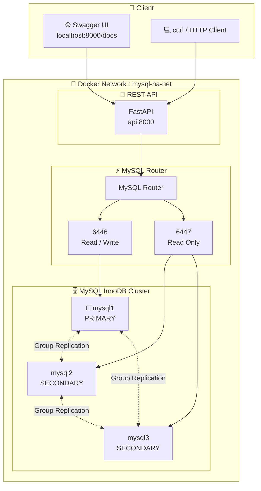

# Arsitektur mysql-ha-lab

## Gambaran Umum

mysql-ha-lab mengimplementasikan **MySQL High Availability** menggunakan:

| Komponen | Teknologi | Fungsi |
|---|---|---|
| Database Cluster | MySQL InnoDB Cluster | 3 node replikasi (1 Primary + 2 Secondary) |
| Load Balancer | MySQL Router | Single endpoint untuk aplikasi |
| REST API | FastAPI (Python) | Simulasi aplikasi produksi |
| Container | Docker Compose | Orkestrasi seluruh service |

---

## Diagram Arsitektur



---

## Alur Data

### Write Operation (INSERT / UPDATE / DELETE)
```
Client → FastAPI → MySQL Router (:6446 RW) → Primary (mysql1)
                                               ↓
                                    Group Replication
                                               ↓
                                  Secondary (mysql2, mysql3)
```

### Read Operation (SELECT)
```
Client → FastAPI → MySQL Router (:6446 RW) → Primary (mysql1)
```
> **Catatan:** Dalam konfigurasi lab ini, FastAPI hanya menggunakan port RW (6446) untuk semua operasi agar lebih mudah dipahami. Pada production, READ bisa diarahkan ke port RO (6447).

---

## Failover Flow

```
1. mysql1 (Primary) mati
        ↓
2. Group Replication mendeteksi failure
        ↓
3. Election: mysql2 atau mysql3 terpilih sebagai Primary baru
        ↓
4. MySQL Router mendeteksi Primary baru (auto)
        ↓
5. Koneksi baru dari FastAPI diarahkan ke Primary baru
        ↓
6. Aplikasi tetap berjalan TANPA restart / perubahan config
```

---

## Port Mapping

| Service | Container Port | Host Port | Keterangan |
|---|---|---|---|
| mysql1 | 3306 | 3306 | MySQL Node 1 (Primary awal) |
| mysql2 | 3306 | 3307 | MySQL Node 2 |
| mysql3 | 3306 | 3308 | MySQL Node 3 |
| mysql-router | 6446 | 6446 | Read/Write endpoint |
| mysql-router | 6447 | 6447 | Read Only endpoint |
| api | 8000 | 8000 | REST API + Swagger |

---

## Network

```
Network: mysql-ha-net (bridge)
Subnet : 172.20.0.0/24

Semua container berada dalam satu network sehingga:
  - Container dapat saling berkomunikasi menggunakan hostname
  - Isolasi dari network host
```

---

## Volume

| Volume | Mount Point | Keterangan |
|---|---|---|
| mysql1-data | /var/lib/mysql | Data persistence mysql1 |
| mysql2-data | /var/lib/mysql | Data persistence mysql2 |
| mysql3-data | /var/lib/mysql | Data persistence mysql3 |
| router-data | /var/lib/mysqlrouter | Konfigurasi router |
